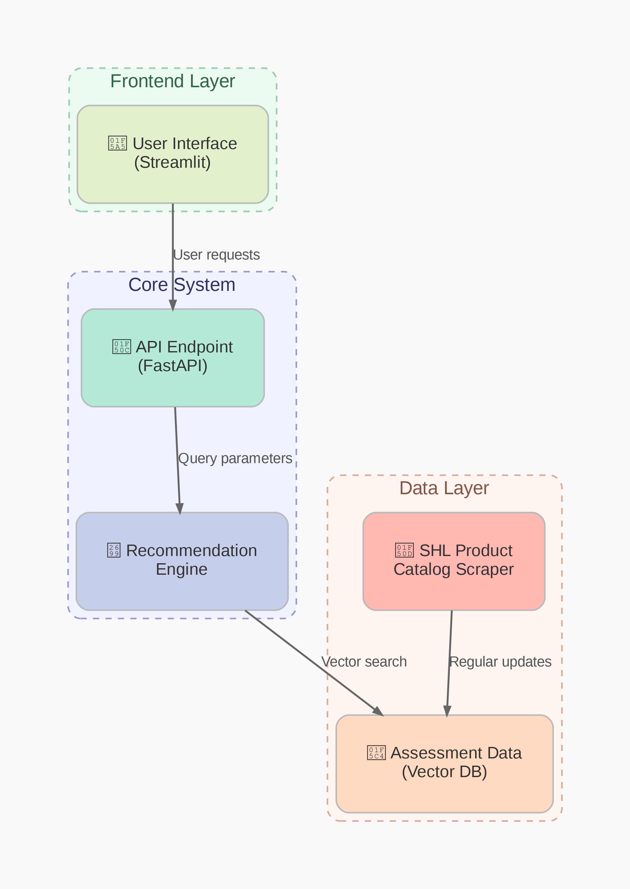

# SHL Assessment Recommendation Engine (RAG-based)

##  Project Overview

This is a Generative AI based SHL Assessment Recommendation System that helps users (like HR professionals, hiring managers, or candidates) find the most relevant SHL assessments by just entering a few keywords. Instead of going through 100s of pages in the SHL catalog, this engine gives the top-3 most relevant assessments using Retrieval Augmented Generation (RAG) with open-source embedding models and custom evaluation metrics (MAP@3, Recall@3).

This was built as a part of the SHL AI Internship assignment using **only open-source tools** (no OpenAI APIs).

---

##  Features

-  SHL Catalog Scraper (fully automated)
-  Vector Search using FAISS
-  Open-source sentence embeddings (`all-MiniLM-L6-v2`)
-  Evaluation Metrics: MAP@3 and Recall@3
-  Streamlit-based UI with custom blue/purple-themed frontend
-  Reranking with cosine similarity
-  Verified only with official SHL URLs

---

##  System Architecture



---

## 🛠️ Setup Instructions

### 1. Clone the repository

```bash
git clone https://github.com/your_username/shl-recommendation-engine.git
cd shl-recommendation-engine
```

### 2.  Install requirements
```bash
pip install -r requirements.txt
```

### 3. Scrape SHL assessments
```bash
python scraper.py
```
- This script scrapes SHL’s official catalog and saves assessment metadata.
  
### 4. Build the recommendation engine
```bash
python recommend_engine.py
```
#### This script:
- Loads scraped data
- Generates embeddings using all-MiniLM-L6-v2
- Indexes them using FAISS
- Prepares the retrieval pipeline

### 5. Evaluate the system (MAP@3, Recall@3)
```bash
python evaluator.py
```
- This uses a JSON test dataset (you can modify it) to compare ground truth vs retrieved assessments.
  
### 6. Run the Api
```bash
python api.py
```
- Start the Api call
- 
### 7. Run the Streamlit App
```bash
streamlit run app.py
```
- This launches a local app where users can enter queries and get  SHL assessment recommendations.

## Project Structure
.
├── app.py                  # Streamlit UI frontend
├── api.py                  # Querying logic and backend API functions
├── recommend_engine.py     # Embedding, vector indexing, recommendation logic
├── evaluator.py            # MAP@3, Recall@3 computation
├── scraper.py              # SHL catalog web scraping
├── requirements.txt        # Python dependencies
├── System_achicture.png    # High-level architecture diagram
└── Updated SHL AI Intern RE Generative AI assignment.pdf

## Model Used 
- **Embedding Model:** sentence-transformers/all-MiniLM-L6-v2
    - Fast and lightweight
    - Gives 384-dim sentence vectors
- **Vector Store:** FAISS with Inner Product Index (IndexFlatIP)

## Evaluation Metrics
- MAP@3: Measures ranking precision
- Recall@3: Measures how many correct assessments were captured in top 3
  
These are printed out for each test query and averaged across the dataset

##  SHL Catalog Data
All scraped URLs and assessment descriptions are from:
https://www.shl.com/en/assessments/solutions/

I only use verified SHL links to maintain recommendation accuracy.

## API Endpoints 
The system provides a REST API for integration with other applications:

**Base URL**: https://shl-assessment-recommendation-system-561x.onrender.com

**Endpoints**:
  - `GET /health` - Check API status
  - `POST /recommend` - Get assessment recommendations
  - `/docs` - Use Swagger docs (auto-generated FastAPI UI)

## Credit 
Author: Bishal Roy 

Email: roybishal9989@gmail.com


