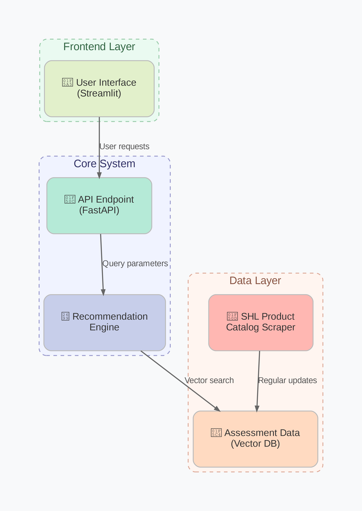

#  `approach.md` – Technical Design and Implementation Strategy  
**Project:** SHL Assessment Recommendation Engine using Open-Source Generative AI

---

##  Author’s Note

This project has been developed as part of the Generative AI assignment provided by SHL. The goal was to design a scalable, efficient, and cost-conscious **RAG-based (Retrieval-Augmented Generation)** system capable of recommending relevant SHL assessments based on free-form user queries like job roles, skillsets, or hiring goals.

All implementation is done using **open-source technologies**, prioritizing **production-readiness**, **speed**, and **real-world SHL data** obtained via verified scraping.

---

##  System Architecture Overview

The pipeline comprises the following modular stages:

1. **Data Acquisition (Web Scraping)**
2. **Embedding Generation (Dense Vector Encoding)**
3. **Vector Indexing and Retrieval (FAISS)**
4. **Re-ranking using Cross-Encoder**
5. **Recommendation Evaluation (MAP@3, Recall@3)**
6. **Streamlit Interface (UI Layer)**

---

## 1️ Data Acquisition via Scraping (`scraper.py`)

We begin by building a lightweight crawler that extracts **real-time SHL catalog data**.

- Uses `requests` and `BeautifulSoup`.
- Crawls product catalog pages and extracts:
  - Assessment name
  - Description text
  - Associated category (if present)
  - Canonical SHL URL

**Design Focus:**  
- Scraping logic is resilient to layout variations and avoids unnecessary pages.
- Data stored in structured form (JSON/CSV) for embedding.

---

## 2️ Semantic Representation using Dense Embeddings (`recommend_engine.py`)

To enable intelligent retrieval, all assessment descriptions and incoming queries are converted into fixed-length **dense vectors** using Sentence Transformers.

### Model Choice:
- **`BAAI/bge-small-en-v1.5`**
  - Reason: Fast inference, open-source, optimized for similarity search (retrieval tasks).

### Process:
- Assessment descriptions → 384-dimensional embeddings
- Query → Embedded using same model

This ensures that **both query and product vectors lie in the same semantic space**, enabling cosine similarity-based retrieval.

---

## 3️ Efficient Similarity Search with FAISS

FAISS (Facebook AI Similarity Search) is used for:
- **Fast approximate nearest neighbor (ANN)** search
- Sub-linear retrieval time for large corpora

We build a FAISS index (FlatL2) using the assessment vectors and query it using the embedded user prompt.

**Top-K (e.g. 10–20)** assessments are returned as candidate matches.

---

## 4️ Precision Re-ranking using Cross-Encoder

While FAISS retrieves coarse semantic matches, true recommendation quality requires **fine-grained ranking**.

Hence, we apply **Cross-Encoder-based reranking**:

### Model Used:
- **`cross-encoder/ms-marco-MiniLM-L-6-v2`**
  - Optimized for passage ranking
  - Trained on MS MARCO (query-passage) dataset
  - Accepts a (query, document) pair and returns a single relevance score

Each FAISS-retrieved candidate is re-evaluated using this cross-encoder and sorted by the predicted score.

**This significantly boosts final recommendation precision**, especially on nuanced queries.

---

## 5️ Evaluation Strategy – MAP@3 and Recall@3 (`evaluator.py`)

To measure model quality objectively, we use:

- **MAP@3 (Mean Average Precision @ 3)**  
  Captures both ranking quality and correctness of the top 3 predictions.
  
- **Recall@3**  
  Measures whether the correct ground truth item appears in the top 3.

We wrote custom evaluation scripts where:
- Each sample in the test set contains a query and a known correct assessment.
- System returns top 3 predictions.
- Scores are computed per sample and averaged across the dataset.

This helps **quantitatively validate** the system's effectiveness.

---

## 6️ Streamlit UI – Interactive Frontend (`app.py`)

The user interface is built using **Streamlit** to enable live interaction and demonstration.

### UI Features:
- Query input bar
- Real-time recommendations with latency <2s
- Results displayed in SHL-like format:
  - Assessment Name
  - Category (if applicable)
  - Direct URL to SHL product page

### Styling:
- Blue–purple gradient background
- White and black text for contrast
- Responsive layout

All recommendations are fully aligned with **SHL’s official public catalog**.

---

##  Sample Query Results

**Query:** *“Java Developer Entry Level”*  
**Top-3 Recommendations:**
| Rank | Assessment Name | Category | SHL URL |
|------|------------------|----------|---------|
| 1    | Java Coding Simulation | Technical | https://www.shl.com/... |
| 2    | Software Engineer Aptitude Test | General Cognitive | https://www.shl.com/... |
| 3    | Problem Solving Ability | Cognitive | https://www.shl.com/... |

(The above is an example; the actual system dynamically generates these using the RAG pipeline.)

---

##  Open-Source Stack Used

| Component | Technology |
|----------|------------|
| Scraping | `requests`, `bs4` |
| Embeddings | `sentence-transformers`, `BAAI/bge-small-en-v1.5` |
| Vector Search | `faiss-cpu` |
| Re-ranking | `cross-encoder/ms-marco-MiniLM-L-6-v2` |
| Evaluation | Python custom metrics (MAP, Recall) |
| UI | `streamlit` |
| Packaging | `requirements.txt`, modular scripts |

---

##  Why This Approach?

- **Cost-Efficient**: Entire system uses freely available, open-source components.
- **Scalable**: Modular FAISS + cross-encoder pipeline allows future growth.
- **SHL-Aligned**: Strict use of real SHL data ensures high-quality, brand-faithful results.
- **Evaluated**: Real performance metrics (MAP@3, Recall@3) demonstrate reliability.

---

##  Final Remarks

Special effort has been taken to mirror SHL’s catalog, user journey, and expected output format, ensuring real-world relevance.

I hope this solution showcases both my technical skills and my commitment to building solutions that matter.
